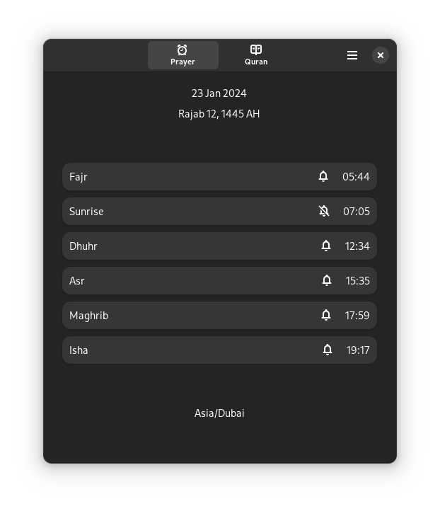

## About
Eeman is an application to get Salah (Prayer) timings and read the beautiful Quran with more features planned.

### Check Prayer timings
Prayer Light theme             |  Prayer Dark theme
:-------------------------:|:-------------------------:
  |  

### Read the beautiful Quran 
Quran Light theme             |  Quran Dark theme
:-------------------------:|:-------------------------:
  |  

## LICENSE
This project is under GPL-3.0 license

## Credits
Alhamdulillah (Praise be to Allah)

[Islamic Network](https://islamic.network/) - For amazing al-adhan, al-quran APIs

